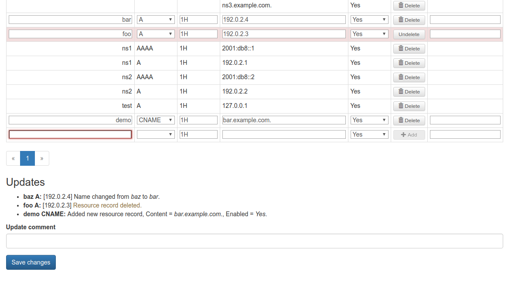
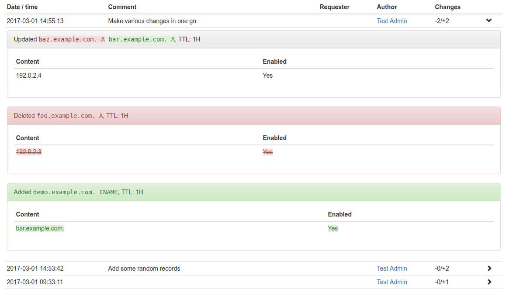

Opera DNS UI
============

A tool to manage a PowerDNS authoritative server in a corporate LDAP-driven environment.

Features
--------

* Connects to PowerDNS via its JSON API.
* Allows login managed by LDAP server.
* Create zones; add, edit and delete records.
* Grant multiple users access to administer a zone.
* Lower access level that allows to view a zone and *request* changes.
* Provides its own JSON API for making changes to DNS records.
* Keeps a changelog of all DNS changes done through it.
* (Optionally) export all zones as bind-format zone files and store changes in git.

Demo
----

You can view the DNS UI in action on the [demonstration server](https://dnsui.xiven.com/).

Use one of the following sets of username / password credentials to log in:

* testuser / testuser - normal user with admin access granted to a few domains
* testadmin / testadmin - admin user

All data on this demonstration server is reset nightly at 00:00 UTC.

Compatibility
-------------

The current version is only compatible with PowerDNS 4.0.4 and higher. Previous 4.0.x versions suffer from a critical API bug related to TTL values.

As another option, you can use PowerDNS 3 with
[Opera DNS UI v0.1.3](https://github.com/operasoftware/dns-ui/releases/tag/v0.1.3), but the 0.1 version of the DNS UI will not receive any new features or non-critical fixes.

Requirements
------------

* Apache 2.2.18 or higher
* PHP 5.6 or higher
* PHP intl (Internationalization Functions) extension
* PHP JSON extension
* PHP LDAP extension
* PHP PDO_PGSQL extension
* PostgreSQL database
* PowerDNS authoritative server (>= 4.0.4)

Installation
------------

1.  Configure PowerDNS:

        webserver=yes
        webserver-address=...
        webserver-allow-from=...
        webserver-port=...
        api=yes
        api-key=...

2.  Clone this repo to somewhere *outside* of your default Apache document root.

3.  Create a postgresql user and database.

        createuser -P dnsui-user
        createdb -O dnsui-user dnsui-db

4.  Add the following directives to your Apache configuration (eg. virtual host config):

        DocumentRoot /path/to/dnsui/public_html
        DirectoryIndex init.php
        FallbackResource /init.php
        AllowEncodedSlashes NoDecode

5.  Set up authnz_ldap for your virtual host (or any other authentication module that will pass on an Auth-user
    variable to the application).

6.  Copy the file `config/config-sample.ini` to `config/config.ini` and edit the settings as required.

7.  Set `scripts/ldap_update.php` to run on a regular cron job.

Usage
-----

Anyone in the LDAP group defined under `admin_group_cn` in `config/config.ini` will be able to add and modify all zones.
They will also be able to grant access under "User access" for any zone to any number of users.

Screenshots
-----------

### Editing multiple records in one batch

### Comprehensive changelog of all changes

License
-------

Copyright 2013-2018 Opera Software

Licensed under the Apache License, Version 2.0 (the "License");
you may not use this file except in compliance with the License.
You may obtain a copy of the License at

   http://www.apache.org/licenses/LICENSE-2.0

Unless required by applicable law or agreed to in writing, software
distributed under the License is distributed on an "AS IS" BASIS,
WITHOUT WARRANTIES OR CONDITIONS OF ANY KIND, either express or implied.
See the License for the specific language governing permissions and
limitations under the License.
